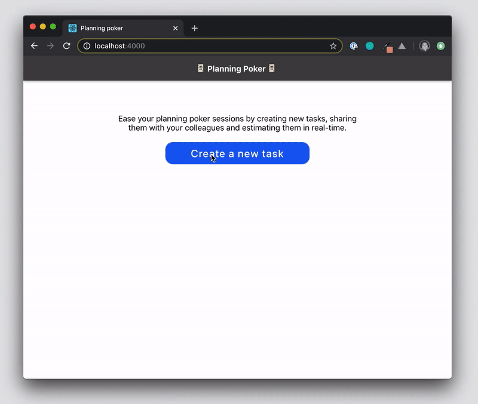

# planning-poker
> Create tasks, estimate them with your coworkers and visualize results in real-time

* [About](#about)
* [Product perspective](#product-perspective)
* [System architecture](#system-architecture)
* [Getting started](#getting-started)
* [Trade-offs](#trade-offs)




## About
In order to estimate how complex a task is for a team of developers to complete, a common technique that is used is called ["planning poker"](https://en.wikipedia.org/wiki/Planning_poker).

Each developer gets to vote on a task by giving their estimate as a point.

The set of points you can cast your vote on is usually a predefined set of arbitrary numbers, something like this: 0, 1/2, 1, 2, 3, 5, 8, 13.

The higher the number, the more complex the task is to complete.

When everyone has cast their votes, the team can have a discussion about what points the different team members have given to a task.

This application allows you to:
- Create new tasks and share them to your coworkers
- Join an existing task
- Vote for a task (and change your vote if need be)
- Compute results of a task with each new vote
- Visualize results of a task in real-time


## Product perspective
Modeling wise, two approachs confront each other:
- One task-centric, where a task has all the responsibilities, from creating new participants to handling the votes
- One sharing the responsibilities between users and tasks, where a user can create new tasks and vote on them

Even though the second approach scales more easily and allow users to reuse their profile for several tasks, the first one is simpler to implement – much like an anonymous chat – where a user is a temporary session that can apply a vote.

That being, the following definitions represents the core domain of the planning poker app:
- **User**: Object representing a physical user of the app that can vote on a specific task using its identifier. When a user votes several times on the same task, it replaces the previous one.
- **Task**: Entity, unique by its identifier, which can create new users and compute its result everytime a vote is made.
- **Task Identifier**: Unique identifier of a task that can be used by users to vote.
- **Vote**: Object that holds the choice of a specific user made for a specific task. A vote can be updated at any point in time. Its value belongs to a pre-defined set of values.


## System architecture
This project takes a simple approach of a server-side application, the tasks manager, owning the business logic and a front-end client to display the info and interact with it.

The tasks manager follows an hexagonal architecture:
- A domain layer composed of entities and aggregates, the core components of the application, and of use cases which arrange them to serve the business logic of the application.
- An infrastructure layer composed of:
    - Repositories to persist the aggregates
    - Adapters binding together the repositories and the use cases
    - Interfaces (HTTP controllers in this case) exposing the adapters over HTTP

The webapp follows a more simpler React only approach organized following a simili-atomic organization:
- Organisms bear the logic and are responsible of maintaining the state of the app
- Molecules are dumb components displaying their props


## Getting started
This project runs with Yarn. Take a look at the official Yarn [documentation](https://classic.yarnpkg.com/en/docs/install/#mac-stable) to install it.

### Tasks manager (server)
The tasks manager runs with Node.js **12.4+** version and is developed with **ECMAScript 2018** as the main target (you can take a look [here](https://node.green/) for more information on the support of ECMAScript in Node.js). To manage your Node.js version, please use [NVM](https://github.com/nvm-sh/nvm). It can be installed with Homebrew without any problems thanks to this [formulae](https://formulae.brew.sh/formula/nvm). When NVM is installed on your environment, install the last Node.js **LTS** with the following command:

```
$ nvm install --lts
```

Then set the default version that will be used by NVM with the following command (replace **{node-version}** with the version you have installed):

```
$ nvm alias default {node-version}
```

To install project dependencies, use the following command:
```
$ yarn
```

After that, you can start the project with the start script:
```
$ yarn build ; yarn start
```

### Webapp
The webapp runs using [React](https://reactjs.org/). To install project dependencies, use the following command:
```
$ yarn
```

You can start the app with the start script. Open [http://localhost:4000](http://localhost:4000) to view it in the browser.
```
$ yarn start
```


## Trade-offs
- Real-time transfer of the results for a vote is done using long polling _(1 second interval)_ to reduce complexity both on the tasks manager and the webapp (and time of development). A system of Websockets could be implemented for better performance and reduce server load.
- Storage of tasks is done with a in-memory store. If the server is restarted, previous votes for a task are lost. Thanks to the repository pattern, this implementation is loosely coupled with the domain and can be easily replaced with any persistent cache or relational database as long as they keep the same interface as the existing repository.
- For time sake, only the domain, use cases and repository are tested. Typescript's strong typing prevents developers to introduce too many errors when implementing the infrastructure layer. However, presenters would deserve to be tested to ensure consistency of the content returned.
